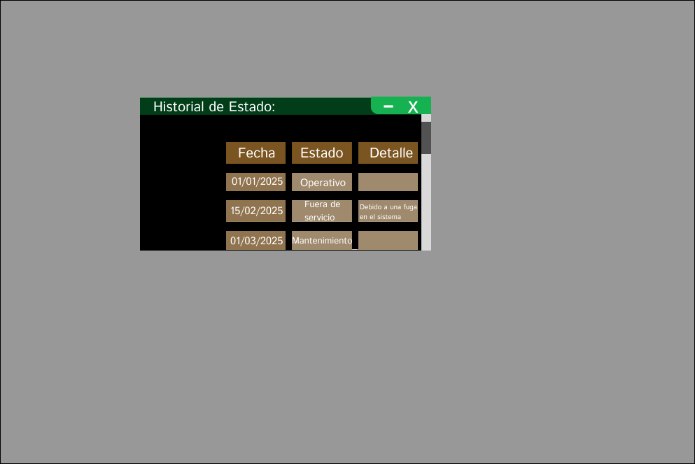

# 3.1. Módulo 1
# Módulo: Gestión de Equipos

# Requerimientos por casos de uso

## 1) Acceso al Dashboard de Gestión de Equipos

| **Campo**           | **Descripción**                                                                 |
|---------------------|---------------------------------------------------------------------------------|
| **Código**          | RGE001                                                                          |
| **Objetivo**        | Gestionar el estado, asignación y mantenimiento de los equipos en la planta.    |
| **Descripción**     | El sistema permite a un **equipo de gestión de equipos** supervisar y gestionar el estado de los equipos, programar su mantenimiento, registrar asignaciones, y realizar un seguimiento de las máquinas sustitutas cuando sea necesario. |
| **Actor Primario**  | Equipo de Gestión de Equipos                                                   |
| **Precondiciones**  | El equipo debe contar con permisos habilitados para acceder al módulo de gestión de equipos. |
| **Pasos**           | 1. El **equipo de gestión de equipos** accede al sistema de gestión de equipos. 2. Visualiza el estado de los equipos en el dashboard. 3. El equipo registra nuevos equipos, asigna equipos a tareas, y planifica el mantenimiento. |

 Requerimientos de Atributos de Calidad:
- **Rendimiento:**
  - La pantalla debe cargarse **en menos de 2 segundos** para garantizar una experiencia de usuario fluida.
  - La visualización de los equipos debe ser rápida, con filtros eficientes para no afectar la experiencia de navegación.
  
- **Usabilidad:**
  - El diseño debe ser **intuitivo**, permitiendo que los usuarios accedan rápidamente a las funciones clave como registros de equipos, asignación y mantenimiento.
  - **Accesibilidad:** Asegurarse de que los botones y opciones sean fáciles de encontrar y usar.
  
- **Disponibilidad:**
  - El sistema debe estar disponible las 24 horas del día para asegurar que el equipo de gestión pueda acceder en cualquier momento.

 Restricciones:
- **Dependencia de permisos:**
  - El acceso a las funcionalidades del módulo depende de los permisos asignados al usuario. Si no tiene permisos adecuados, no podrá ver los datos relevantes.

---

## 2) Equipos registrados
| **Campo**             | **Descripción**                                                                 |
|-----------------------|---------------------------------------------------------------------------------|
| **Código**            | RGE002                                                                          |
| **Objetivo**          | Visualizar los equipos registrados, su estado actual y el historial de cambios. |
| **Descripción**       | El sistema permite al **equipo de gestión de equipos** visualizar los equipos registrados, su estado actual (Operativo, Mantenimiento, Fuera de Servicio), y el historial de estado de cada equipo. |
| **Actor Primario**    | **Equipo de Gestión de Equipos** (Jefe de Logística y responsables de la gestión de equipos) |
| **Precondiciones**    | El usuario debe tener permisos habilitados para acceder al módulo de gestión de equipos. |
| **Pasos**             | 1. El **equipo de gestión de equipos** accede al sistema. 2. Visualiza la lista de equipos registrados con sus estados y la opción de ver detalles. 3. El usuario selecciona "Ver Detalles" para revisar el historial de estado de cada equipo. |

 Requerimientos de Atributos de Calidad:
- Rendimiento:
  - La pantalla debe cargarse en menos de 2 segundos para garantizar una experiencia de usuario fluida.
  - La visualización de los equipos debe ser rápida, con filtros eficientes para no afectar la experiencia de navegación.
  
- Usabilidad:
  - El diseño debe ser intuitivo, permitiendo que los usuarios accedan rápidamente a las funciones clave como registros de equipos, asignación y mantenimiento.
  - Accesibilidad:
  Asegurarse de que los botones y opciones sean fáciles de encontrar y usar.
  
- Disponibilidad:
  - El sistema debe estar disponible las 24 horas del día para asegurar que el equipo de gestión pueda acceder en cualquier momento.

 Restricciones:
- Dependencia de permisos:
  - El acceso a las funcionalidades del módulo depende de los permisos asignados al usuario. Si no tiene permisos adecuados, no podrá ver los datos relevantes.

---
## 3) Registro y actualizacion de equipos
| **Campo**             | **Descripción**                                                                 |
|-----------------------|---------------------------------------------------------------------------------|
| **Código**            | RGE003                                                                          |
| **Objetivo**          | Registrar nuevos equipos o actualizar la información de los existentes en el sistema. |
| **Descripción**       | El sistema permite al **equipo de gestión de equipos** agregar, actualizar o eliminar equipos, registrando información clave como código, tipo, estado y descripción. |
| **Actor Primario**    | **Equipo de Gestión de Equipos** (Jefe de Logística y responsables de la gestión de equipos) |
| **Precondiciones**    | El usuario debe tener permisos habilitados para acceder al módulo de gestión de equipos. |
| **Pasos**             | 1. El **equipo de gestión de equipos** accede al sistema. 2. El usuario visualiza el formulario de **registro y actualización de equipos**. 3. El usuario ingresa o modifica los datos del equipo, como código, tipo, estado, fecha de registro y descripción. 4. El sistema guarda los datos actualizados o nuevos en la base de datos. |

 Requerimientos de Atributos de Calidad:
- **Rendimiento:**
  - La pantalla debe ser **rápida**, con tiempos de carga inferiores a 3 segundos para registrar o actualizar equipos.

- **Usabilidad:**
  - La interfaz debe permitir la **edición de los datos del equipo** con facilidad, evitando procesos complicados.
  
- **Exactitud:**
  - Debe garantizar que la información registrada sea correcta y completa, validando que no falten datos importantes como el código del equipo y el estado.

# Restricciones:
- **Acceso restringido:** 
  - La opción para agregar o actualizar equipos debe estar limitada a los usuarios con permisos administrativos.

---

## 4) Programar asignacion de equipos

| **Campo**             | **Descripción**                                                                 |
|-----------------------|---------------------------------------------------------------------------------|
| **Código**            | RGE004                                                                          |
| **Objetivo**          | Asignar equipos a tareas específicas dentro del proceso logístico o de producción, y visualizar la disponibilidad de los equipos. |
| **Descripción**       | El sistema permite al **equipo de gestión de equipos** seleccionar un equipo registrado, asignarlo a un área y tarea específica, y programar su uso según la disponibilidad y las necesidades de producción. |
| **Actor Primario**    | **Equipo de Gestión de Equipos** (Jefe de Logística y el personal encargado de la gestión de equipos) |
| **Precondiciones**    | El equipo debe estar registrado, y la tarea o proceso debe estar planificado. |
| **Pasos**             | 1. El **equipo de gestión de equipos** accede al sistema. 2. El usuario visualiza el formulario donde selecciona el equipo, el área de asignación, el responsable y las fechas de inicio y fin. 3. El usuario selecciona el calendario con la disponibilidad de equipos en tiempo real. 4. El sistema confirma la asignación del equipo y actualiza la programación en el sistema. |
 Requerimientos de Atributos de Calidad:
- **Rendimiento:**
  - La carga y actualización de la programación debe realizarse en **menos de 3 segundos**.
  - Los cambios deben reflejarse en tiempo real.

- **Usabilidad:**
  - Interfaz intuitiva para asignar equipos rápidamente con un calendario visual.
  - Accesibilidad: Debe ser responsiva y fácil de usar en dispositivos móviles y de escritorio.

- **Interactividad:**
  - Permite actualizar asignaciones con notificaciones en tiempo real de cambios.

 Restricciones:
- **Restricción de cambios:** No se pueden modificar las asignaciones una vez que la tarea haya comenzado.
- **Acceso restringido:** Solo usuarios con permisos adecuados (Jefe de Logística, Administradores) pueden realizar asignaciones.
- **Disponibilidad:** Solo se pueden asignar equipos que estén disponibles y no asignados a otras tareas o en mantenimiento.
- **Conflictos de programación:** El sistema alertará sobre conflictos de disponibilidad de equipos y ofrecerá alternativas.
## 5) Programar mantenimiento de equipos

| **Campo**             | **Descripción**                                                                 |
|-----------------------|---------------------------------------------------------------------------------|
| **Código**            | RGE005                                                                          |
| **Objetivo**          | Programar el mantenimiento preventivo y correctivo de los equipos registrados.  |
| **Descripción**       | El sistema permite al **equipo de gestión de equipos** programar mantenimientos preventivos o correctivos de los equipos, gestionar las fechas de entrega, y registrar las máquinas sustitutas mientras el equipo principal está en mantenimiento. |
| **Actor Primario**    | **Equipo de Gestión de Equipos** (Jefe de Logística y el personal encargado de la gestión de equipos y mantenimiento) |
| **Precondiciones**    | El equipo debe estar registrado, y la tarea o proceso debe estar planificado. |
| **Pasos**             | 1. El **equipo de gestión de equipos** accede al sistema. 2. El usuario visualiza la lista de equipos con su estado actual. 3. El usuario selecciona el equipo a mantener y asigna la empresa encargada, tipo de servicio, fecha de entrega, y máquina sustituta. 4. El usuario programa el mantenimiento y guarda la información. 5. El usuario hace clic en el botón **"Añadir"** para registrar la programación del mantenimiento. |
 
  Requerimientos de Atributos de Calidad:
- **Rendimiento:**
  - Los datos de mantenimiento deben cargarse rápidamente (tiempo de respuesta inferior a **2 segundos** para reflejar las actualizaciones).

- **Usabilidad:**
  - La interfaz debe ser **fácil de navegar** para que los usuarios puedan acceder a los historiales de mantenimiento, ver el tipo de mantenimiento (preventivo o correctivo) y las fechas asociadas.

- **Seguridad de los datos:**
  - El sistema debe **proteger los datos de mantenimiento** con medidas de seguridad adecuadas, asegurando que solo los usuarios autorizados puedan modificar los registros.

 Restricciones:
- **Solo lectura para el historial:**  
  - El historial de mantenimiento no debe ser alterado por usuarios no autorizados. Solo los administradores pueden modificar los detalles.

## 6) Historial de Equipos

| **Campo**             | **Descripción**                                                                 |
|-----------------------|---------------------------------------------------------------------------------|
| **Código**            | RGE006                                                                          |
| **Objetivo**          | Visualizar el historial de mantenimiento y estado de los equipos registrados.   |
| **Descripción**       | El sistema permite al **equipo de gestión de equipos** consultar el historial de cada equipo, mostrando las fechas de mantenimiento, el tipo de servicio realizado, y el estado de la máquina a lo largo del tiempo. Además, ofrece la opción de exportar el historial en formato **PDF**. |
| **Actor Primario**    | **Equipo de Gestión de Equipos** (Jefe de Logística y el personal encargado de la gestión de equipos) |
| **Precondiciones**    | El equipo debe estar registrado, y debe haber registros de mantenimiento y estados previos. |
| **Pasos**             | 1. El **equipo de gestión de equipos** accede al sistema. 2. El usuario visualiza la tabla con el historial de los equipos, incluyendo fechas, tipos de servicio y estado. 3. El usuario puede hacer clic en el botón **"Descargar PDF"** para exportar el historial a un archivo PDF. |

 Requerimientos de Atributos de Calidad:
- **Rendimiento:**
  - La **generación de reportes** debe ser eficiente, permitiendo al usuario generar informes sin retrasos (menos de 5 segundos).

- **Usabilidad:**
  - El sistema debe permitir la **fácil visualización** de la información de los equipos con gráficos y tablas de rendimiento.
  
- **Interactividad:**  
  - El sistema debe permitir al usuario interactuar con los reportes generados y ofrecer filtros para personalizar los informes.

 Restricciones:
- **Acceso solo a usuarios autorizados:**
  - Los reportes detallados deben estar disponibles solo para usuarios con el rol adecuado (por ejemplo, Jefe de Logística, Administrador).

---

---

# Prototipo del Módulo de Gestión de Equipos para Agrovision Perú S.A.C.

## 1) Pantalla Principal (Dashboard)

### Requerimientos asociados:
- **Acceso del encargado de logística** al sistema de gestión de equipos.

### Descripción de la interfaz:
- **El jefe de logística o mantenimiento accede al panel principal del módulo de gestión de equipos.** Desde esta pantalla, el usuario podrá:
  - **Ver el estado general de los equipos:** 
    - Visualización rápida de los equipos disponibles, en uso, en mantenimiento y fuera de servicio.
    - Los equipos se visualizan con colores e iconos según su disponibilidad (verde: disponible, amarillo: en uso, rojo: en mantenimiento).

### Interacción con los botones del prototipo:
- **Equipos Registrados**:
  - El botón de "Ir a Equipos Registrados" permite al usuario visualizar todos los equipos previamente registrados en el sistema.
  
- **Programar Asignación de Equipos**:
  - El botón "Ir a Programar Asignaciones" lleva al usuario a la pantalla donde puede asignar los equipos a tareas específicas, programando su uso y disponibilidad.
  
- **Registro y Actualización de Equipos**:
  - El botón "Ir a Registrar Nuevos Equipos o actualizar" facilita la adición o modificación de equipos dentro del sistema.

- **Programación de Mantenimiento de Equipos**:
  - Desde el botón "Ir a Programación de Mantenimiento" el usuario puede gestionar los servicios de mantenimiento preventivo y correctivo de los equipos.

- **Historial de Equipos**:
  - El botón "Ir a Generar Reporte de Equipos" permite generar reportes detallados con el historial completo de mantenimiento y estado de los equipos.

### Rendimiento necesario:
- **Proceso:** En línea
- **Rendimiento necesario:** Medio
- **Volumen de información:** Bajo a medio (El usuario solo accede a opciones y no a datos masivos).

### Pantalla: 

---

## 2) Pantalla de Equipos Registrados

### Requerimientos asociados:
- Visualización de los equipos registrados en el sistema.

### Descripción de la interfaz:
- **Listado de Equipos Registrados:**
  - Una **tabla con los equipos** registrados que muestra:
    - **Código del equipo**
    - **Tipo de equipo**
    - **Estado del equipo** (Operativo, Mantenimiento, Fuera de servicio)
    - **Acciones** disponibles: **Ver detalles**.
  
  Esta pantalla está orientada solo a **visualización**, no permite editar ni eliminar los equipos.

### Rendimiento necesario:
- **Proceso:** En línea
- **Rendimiento necesario:** Bajo
- **Volumen de información:** Bajo (Solo visualización rápida sin modificaciones).

### Pantalla: 

-detalle.

---

## 3) Pantalla de Programar Asignación de Equipos

### Requerimientos asociados:
-  Visualizacion de la asignación de equipos a tareas específicas.

### Descripción de la interfaz:
  - Los usuarios pueden seleccionar un **equipo** y asignarlo a tareas dentro de una **fecha y hora específicas**.
  - El botón **"Calendario con Disponibilidad"** permite ver los equipos disponibles para asignación en la fecha solicitada.
  - El sistema muestra un mensaje de advertencia si un equipo ya está asignado o no está disponible.

### Rendimiento necesario:
- **Proceso:** En línea
- **Rendimiento necesario:** Medio
- **Volumen de información:** Medio

### Pantalla: 

---

## 4) Pantalla de Programación de Mantenimiento de Equipos

### Requerimientos asociados:
- Gestión de mantenimiento preventivo y correctivo de equipos.

### Descripción de la interfaz:
- **Historial de Mantenimiento:**
  - Listado de **equipos en mantenimiento** y **máquinas sustitutas**.
  - **Fecha de entrega** de los equipos a la empresa encargada de la reparación.
  - **Máquinas sustitutas** asignadas mientras el equipo está en mantenimiento.
  - **Estado de la máquina**: En mantenimiento, operativo, fuera de servicio.
  - Botón para **añadir** un nuevo mantenimiento para equipos, y programar fechas de entrega y retorno.

### Rendimiento necesario:
- **Proceso:** En línea
- **Rendimiento necesario:** Medio
- **Volumen de información:** Medio

### Pantalla: 

---

## 5) Pantalla de Registro y Actualización de Equipos

### Requerimientos asociados:
- Registro de nuevos equipos y actualización de los equipos existentes en el sistema.

### Descripción de la interfaz:
- **Formulario de registro:** 
  - **Código de máquina**
  - **Tipo de máquina**
  - **Estado de máquina** (Operativo, Mantenimiento, Fuera de servicio)
  - **Fecha de registro (Automática)**.
  - **Descripción del equipo.**
- **Acción de actualización:** Permite modificar el estado, tipo o descripción de los equipos registrados.
- **Botón de "Registrar/Actualizar Equipo"** que guarda la información modificada o registrada.

### Rendimiento necesario:
- **Proceso:** En línea
- **Rendimiento necesario:** Bajo
- **Volumen de información:** Bajo (Solo actualización de datos básicos de los equipos).

---
### Pantalla: 

---

## 6) Pantalla de Historial de Equipos

### Requerimientos asociados:
- Consultar el historial de mantenimiento de cada equipo.

### Descripción de la interfaz:
- **Listado de historial de equipos**:
  - La vista muestra:
    - **Equipo**
    - **Estado** (Operativo, Mantenimiento, Fuera de servicio).
    - **Fecha de inicio** y **fecha de fin** del mantenimiento.
    - **Máquina sustituta**.
    - **Detalles de mantenimiento** (tipo de mantenimiento realizado).
  - **Botón de "Descargar PDF"** para exportar el historial completo del equipo.

### Rendimiento necesario:
- **Proceso:** En línea
- **Rendimiento necesario:** Medio
- **Volumen de información:** Medio
- **Tiempo de carga:** Los reportes deben generarse en menos de 5 segundos.

### Pantalla: 

---