# 9.1. Sentencias SQL por módulo / prototipo

## Modulo 1 Gestion de equipos
***DASHBOARD***

**Código Requerimiento:** R-101
**Código Interfaz:** I-101
**Imagen Interfaz**
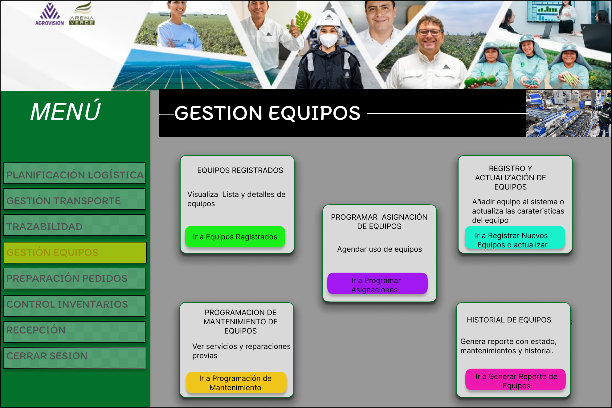

**Eventos:**
1. Botón "Ir a Equipos Registrados" (verde claro):
Redirecciona a la interfaz I-102.

2. Botón "Ir a Registrar Nuevos Equipos o actualizar" (verde agua):
Redirecciona a la interfaz I-103.

3. Botón "Ir a Programar Asignaciones" (morado):
Redirecciona a la interfaz I-104.

4. Botón "Ir a Programación de Mantenimiento" (amarillo):
Redirecciona a la interfaz I-105.

5. Botón "Ir a Generar Reporte de Equipos" (fucsia):
Redirecciona a la interfaz I-106.
---
***EQUIPOS REGISTRADOS***

**Código Requerimiento:** R-102
**Código Interfaz:** I-102
**Imagen Interfaz**
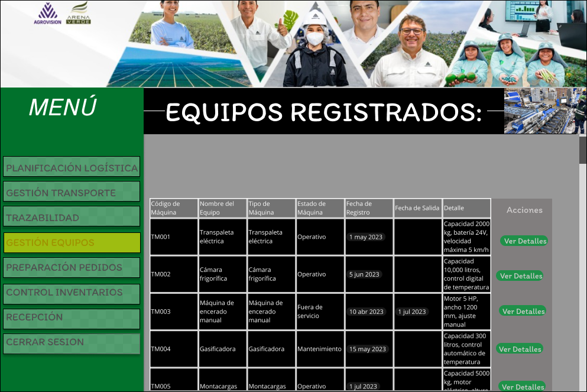


**Eventos:**
1. Se carga la tabla con todos los equipos registrados y sus campos visibles:
Código de Máquina, Nombre del Equipo, Tipo de Máquina, Estado de Máquina, Fecha de Registro, Fecha de Salida, Detalle y Acciones.

Acción: Renderizar todos los datos en la tabla ordenados (por defecto) por Código de Máquina

2. Visualización de botón "Ver Detalles" :El botón aparece para cada fila, aunque sea solo visual.

**Sentencias SQL**
```sql
SELECT
  e.COD_Equipos AS "Código de Máquina",
  e.Nombre_equipo AS "Nombre del Equipo",
  tm.Descripcion AS "Tipo de Máquina",
  ee.Descripcion AS "Estado de Máquina",
  e.Fecha_registro AS "Fecha de Registro",
  CASE
    WHEN ee.ID_Estado_equipo = 'FSE' THEN e.Fecha_salida
    ELSE NULL
  END AS "Fecha de Salida",
  e.Detalle AS "Detalle"
FROM EQUIPOS e
JOIN Tipo_Maquina tm ON e.ID_Tipo_Maquina = tm.ID_Tipo_Maquina
JOIN Estado_Equipo ee ON e.ID_Estado_equipo = ee.ID_Estado_equipo
ORDER BY e.COD_Equipos;
```
**DETALLES***
**Código Requerimiento:** R-102-B
**Código Interfaz:** I-102-B
**Imagen Interfaz**
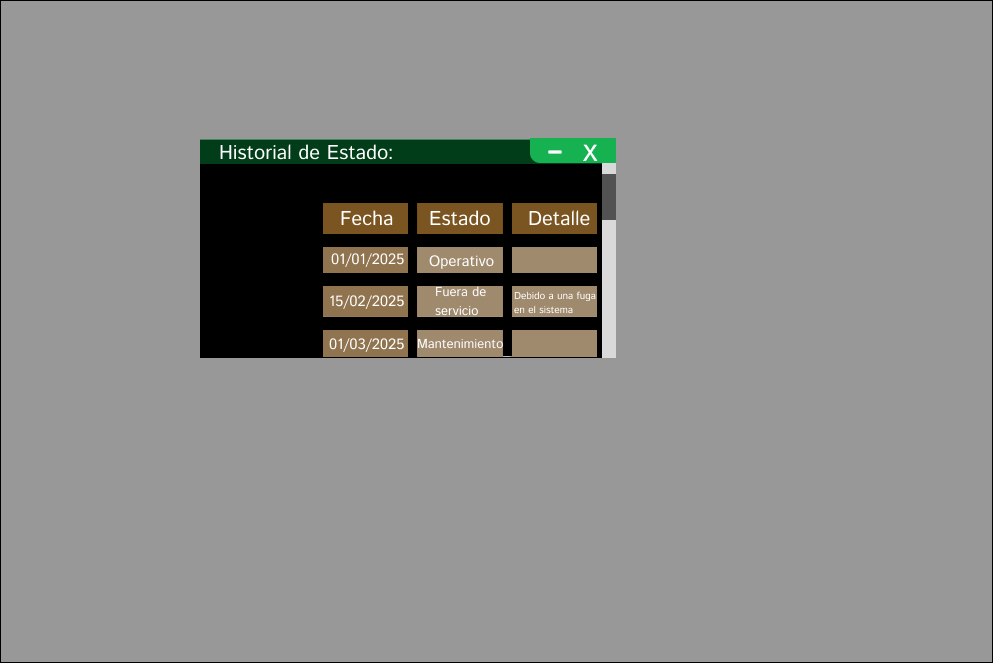

**Eventos:**
1. Al abrir el modal, se realiza la consulta para obtener el historial de estado, con campos Fecha, Estado y Detalle.
Cierre del modal

2. El usuario hace clic en el botón “X” para cerrar la ventana.

**Sentencias SQL**
```sql

SELECT 
  he.Fecha,
  ee.Descripcion AS Estado,
  he.Detalle
FROM Historial_Estado_Equipo he
JOIN Estado_Equipo ee ON he.ID_Estado_equipo = ee.ID_Estado_equipo
JOIN EQUIPOS e ON he.ID_EQUIPOS = e.ID_EQUIPOS
WHERE e.COD_Equipos = 'EQ000001'
ORDER BY he.Fecha;

```
**REGISTRA/ACTUALZAR**
**Código Requerimiento:** R-103
**Código Interfaz:** I-103
**Imagen Interfaz**
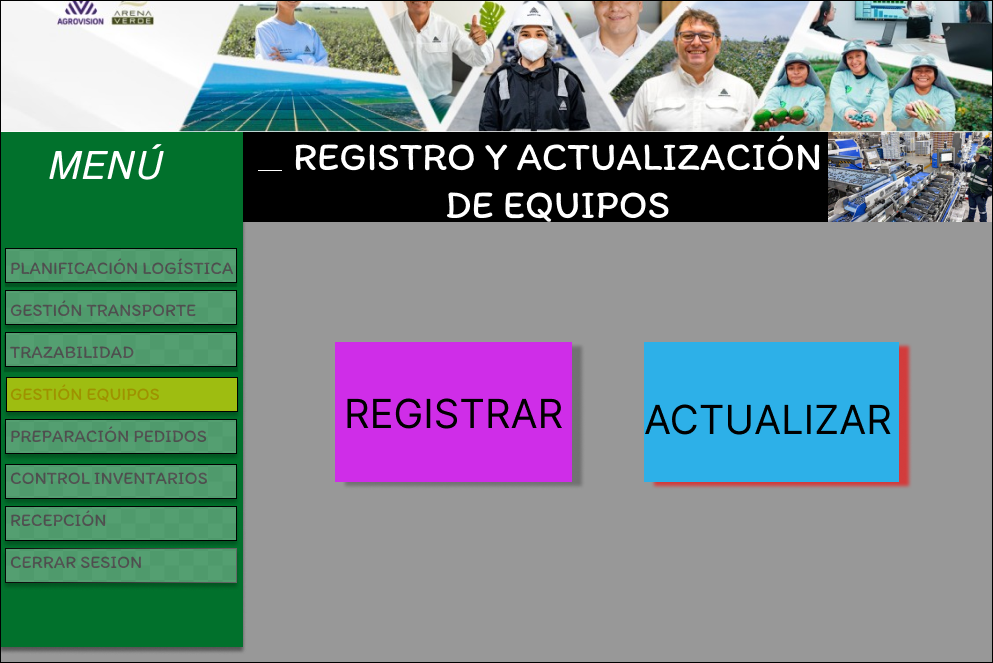
Evento:
I-104 :Boton registrar equipos
I-105: Boton actualizar equipo

**REGISTRAR EQUIPOS***

**Código Requerimiento:** R-104
**Código Interfaz:** I-104
**Imagen Interfaz**


**Eventos:**
1. Al abrir el formulario, el campo Código de Máquina se genera automaticamente ; la Fecha de Registro se autocompleta con la fecha actual y no es editable.

2. El usuario selecciona el Tipo de Máquina y Estado de Máquina desde menús desplegables; debe completar la Descripción.

3. El botón Registrar se habilita solo cuando todos los campos obligatorios estén completos.

4. Al hacer clic en Registrar, se valida la información y, si es correcta, se envía para crear el registro en la base de datos, mostrando un mensaje de éxito o error.

5. Al hacer clic en Cancelar, el formulario se cierra o limpia sin guardar datos.
**Sentencias SQL**
```sql
INSERT INTO Equipos (Nombre_equipo, ID_Tipo_Maquina, ID_Estado_equipo, Detalle)
VALUES ('Montecarga 132', 'TM001', 'OPE', 'Modelo MC500, capacidad de carga 5000 kg, motor eléctrico, altura máxima 3.5m')
RETURNING COD_Equipos, Fecha_registro;
SELECT * FROM Equipos ORDER BY COD_Equipos;
```
**ACTUALIZAR EQUIPO**

**Código Requerimiento:** R-105
**Código Interfaz:** I-105
**Imagen Interfaz**
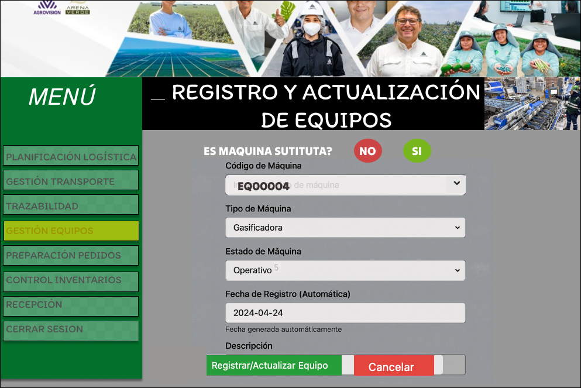
**Eventos:**
1. Abrir formulario con campos Código de Máquina, Tipo de Máquina, Estado, Fecha de Registro (automatico).

2. Usuario completa Tipo de Máquina, Estado y Código del equipos se selecciona .

3. Validar que todos los campos obligatorios estén completos.

4. Habilitar botón Registrar/Actualizar cuando la validación sea exitosa.

5. Usuario hace clic en Registrar/Actualizar para enviar datos con Es_sustituta = FALSE.

6. Mostrar mensaje de éxito o error según resultado.

7. Usuario puede hacer clic en Cancelar para cerrar o limpiar formulario sin guardar.

**Sentencias SQL**
```sql
UPDATE Equipos e
SET
  ID_Estado_equipo = (
    SELECT ID_Estado_equipo
    FROM Estado_Equipo
    WHERE Descripcion = 'Operativo'
  ),
  Fecha_SALIDA = CURRENT_DATE
WHERE e.COD_Equipos = 'EQ000003';
```
**REGISTRO MAQUINA SUSTITUTA**

**Código Requerimiento:** R-106
**Código Interfaz:** I-106
**Imagen Interfaz**
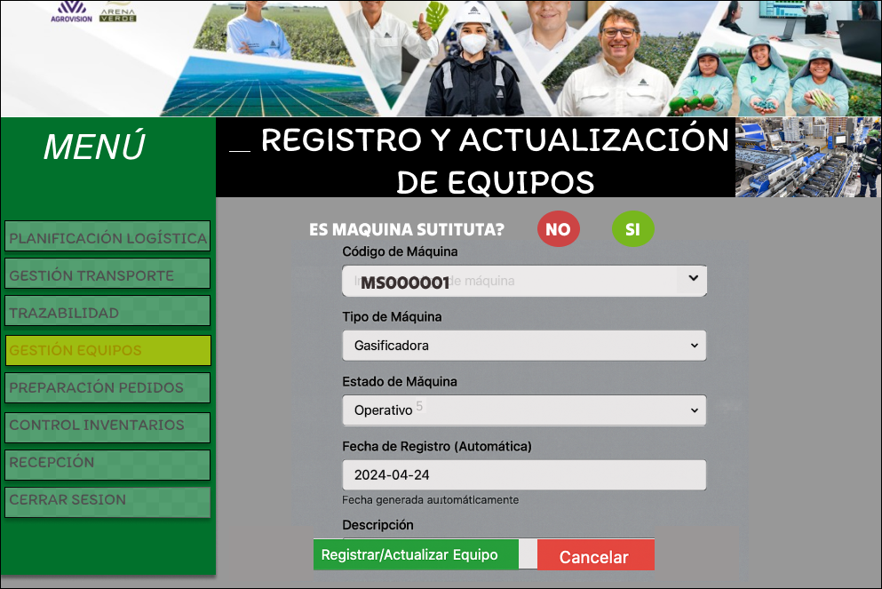
 
 **EVENTOS:**
1. Se abre el formulario con el campo **Código de Máquina** que muestra un código tipo `MS******` (generado o editable).
2. El usuario selecciona el **Tipo de Máquina** desde la lista desplegable.
3. El usuario selecciona el **Estado de Máquina** (por ejemplo, Operativo).
4. La **Fecha de Registro** se muestra automáticamente con la fecha actual y no es editable.
5. Se valida que todos los campos obligatorios estén completos.
6. Se habilita el botón **Registrar/Actualizar Equipo** solo cuando los datos son válidos.
7. Al hacer clic en **Registrar/Actualizar Equipo**, se envían los datos con el atributo `Es_sustituta = TRUE` para registrar o actualizar la máquina sustituta en la base de datos.
9. El sistema muestra un mensaje de éxito o error según el resultado de la operación.
10. El usuario puede hacer clic en **Cancelar** para limpiar el formulario o volver a la pantalla anterior sin guardar cambios.
**Sentencias SQL**
```sql
INSERT INTO MAQUINAS_SUSTITUTAS (
    Nombre_de_maquina,
    ID_Estado_equipo,
    ID_Tipo_Maquina,
    ID_Empleado
) VALUES (
    'Montacargas Sustituto 3000',
    (SELECT ID_Estado_equipo FROM Estado_Equipo WHERE Descripcion = 'Operativo'),
    (SELECT ID_Tipo_Maquina FROM Tipo_Maquina WHERE Descripcion = 'Montacargas'),
    1  -- Empleado que registra (desde login)
);
```

**PLANIFICACION ASIGNACION DE EQUIPOS**
**Código Requerimiento:** R-107
**Código Interfaz:** I-107
**Imagen Interfaz**
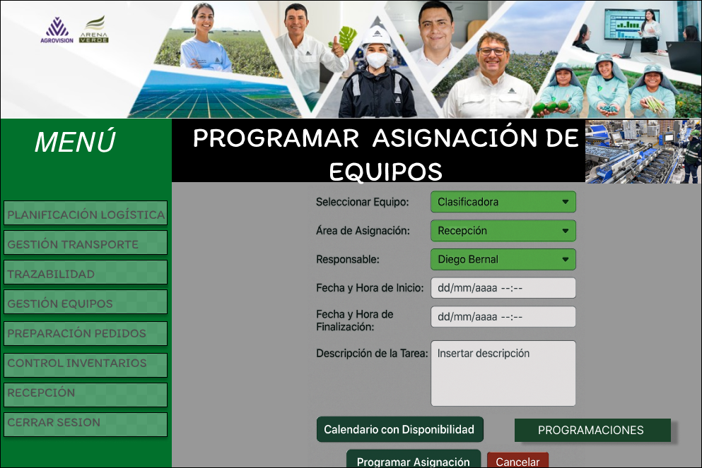
**EVENTOS:**
1. Cargar datos iniciales para los campos desplegables (Equipo, Área, Responsable).

2. Usuario selecciona Equipo, Área, Responsable.

3. Usuario ingresa Fecha y Hora de Inicio y Fecha y Hora de Finalización.

4. Usuario escribe Descripción de la Tarea.

5. Validar que todos los campos obligatorios estén completos.

6. Habilitar botón “Programar Asignación”.

7. Usuario hace clic en “Programar Asignación”.

8. Validar y enviar datos para crear la programación.

9. Mostrar mensaje de éxito o error.

10. Usuario puede cancelar para limpiar o cerrar formulario sin guardar.

**EVENTOS ADICIONALES EN LA PANTALLA**
1. Botón "Calendario con Disponibilidad"
Al hacer clic, se abre un calendario visual donde el usuario puede consultar la disponibilidad de equipos y áreas para las fechas seleccionadas.

2. Botón "Programaciones"
Al hacer clic, se abre una vista o listado con todas las programaciones existentes, permitiendo al usuario consultar, modificar o eliminar.

**Sentencias SQL**

```sql

INSERT INTO PLANIFICACIONES_ASIGNACION (
    Fecha_registro,
    Fecha_de_asignacion,
    Fecha_de_vencimiento,
    Descripcion_de_tarea,
    ID_Area,
    ID_EQUIPOS,
    ID_Empleado_Registra,
    ID_Empleado_Solicita
) VALUES (
    NOW(),  -- Fecha y hora actual

    TO_TIMESTAMP('2025-05-28 14:30:00', 'YYYY-MM-DD HH24:MI:SS'),  -- Fecha y hora inicio
    TO_TIMESTAMP('2025-05-29 18:00:00', 'YYYY-MM-DD HH24:MI:SS'),  -- Fecha y hora fin

    'Descripción de la tarea que será realizada',  -- Descripción de la tarea

    -- Área solicitante (de la asignación)
    (SELECT ID_Area FROM Area WHERE Nombre_del_area = 'Recepción'),

    -- Equipo asignado
    (SELECT ID_EQUIPOS FROM EQUIPOS WHERE Nombre_equipo = 'Clasificadora XZ'),

    -- Empleado registra (por ejemplo, usuario logueado)
    1,

    -- Empleado solicita (responsable externo que sí se muestra en UI)
    (SELECT ID_Empleado FROM Empleado WHERE Nombre_Apellido = 'Lucia Gomez')
);
```
**CALENDARIO PROGRAMACION**
**Código Requerimiento:** R-108
**Código Interfaz:** I-108
**Imagen Interfaz**
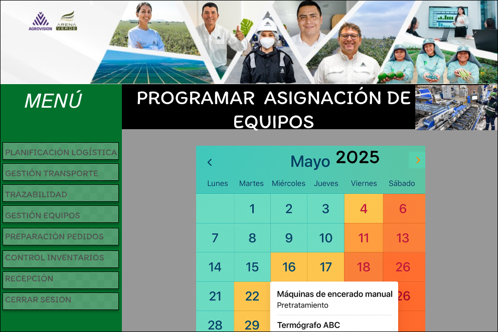
### EVENTOS:
1. El programa inicia cargando el calendario del mes actual con fechas y colores según disponibilidad.

2. El usuario navega entre meses para revisar fechas futuras o pasadas.

3. El usuario selecciona una fecha del calendario para ver las asignaciones programadas ese día.

4. El sistema muestra detalles (equipos y áreas asignadas) en una ventana emergente o sección dedicada.
**Sentencias SQL**
```sql
SELECT 
    e.Nombre_equipo AS equipo,
    a.Nombre_del_area AS area
FROM 
    PLANIFICACIONES_ASIGNACION p
    JOIN EQUIPOS e ON p.ID_EQUIPOS = e.ID_EQUIPOS
    JOIN Area a ON p.ID_Area = a.ID_Area
WHERE 
    '2025-09-05'::date BETWEEN p.Fecha_de_asignacion AND p.Fecha_de_vencimiento
ORDER BY 
    e.Nombre_equipo;
```
**VISUALIZACION PROGRAMACIONES**

**Código Requerimiento:** R-109
**Código Interfaz:** I-109
**Imagen Interfaz**
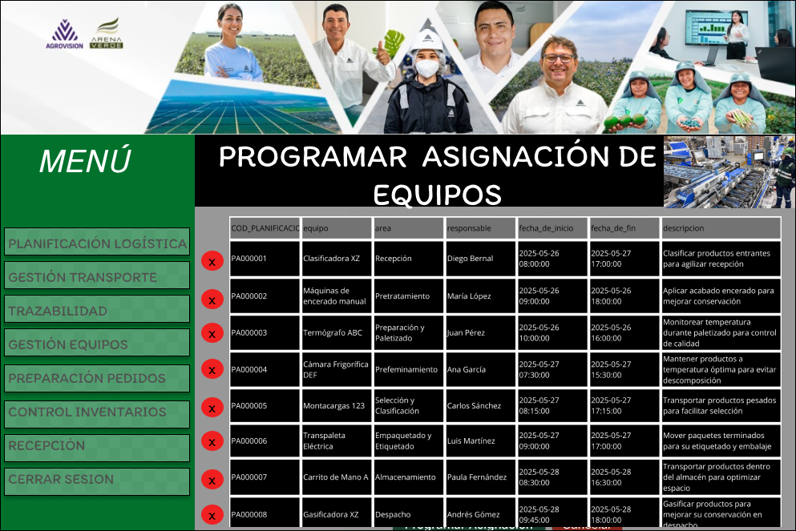
#### EVENTOS:
1. Al cargar la pantalla, se muestra la tabla con todas las programaciones con sus columnas: código, equipo, área, responsable, fechas de inicio y fin, y descripción.

2. El usuario puede recorrer la tabla con scroll vertical para ver todos los registros.

3. La tabla muestra claramente cada dato en columnas bien definidas para facilitar lectura y análisis.

4. El botón rojo (X) en cada fila es visible pero no interfiere con la lectura de datos.

5. Los encabezados de la tabla permanecen fijos o visibles para ayudar a identificar columnas.

### Evento adicional para eliminación condicional:

1. Al hacer clic en el botón **(X)** de una programación, el sistema verifica si la programación **ya fue ejecutada**.
2. Si **no fue ejecutada**, se muestra un diálogo de confirmación para eliminar.
3. Si el usuario confirma, se elimina la programación y se actualiza la tabla.
4. Si la programación **ya fue ejecutada**, se muestra un mensaje indicando que no se puede eliminar.

**Sentencias SQL**
```sql
SELECT
    p.COD_PLANIFICACIONES_ASIGNACION AS codigo_planificacion,
    e.Nombre_equipo AS equipo,
    a.Nombre_del_area AS area,
    es.Nombre_Apellido AS responsable,
    p.Fecha_de_asignacion AS fecha_de_inicio,
    p.Fecha_de_vencimiento AS fecha_de_fin,
    p.Descripcion_de_tarea AS descripcion
FROM
    PLANIFICACIONES_ASIGNACION p
    LEFT JOIN Area a ON p.ID_Area = a.ID_Area
    LEFT JOIN EQUIPOS e ON p.ID_EQUIPOS = e.ID_EQUIPOS
    LEFT JOIN Empleado es ON p.ID_Empleado_Solicita = es.ID_Empleado
ORDER BY
    p.Fecha_de_asignacion DESC;

```
*Eliminacion:*

```sql
DELETE FROM PLANIFICACIONES_ASIGNACION
WHERE COD_PLANIFICACIONES_ASIGNACION = 'PA000003';
```
calendario
```sql
SELECT 
    e.Nombre_equipo AS equipo,
    a.Nombre_del_area AS area
FROM 
    PLANIFICACIONES_ASIGNACION p
    JOIN EQUIPOS e ON p.ID_EQUIPOS = e.ID_EQUIPOS
    JOIN Area a ON p.ID_Area = a.ID_Area
WHERE 
    '2025-09-05'::date BETWEEN p.Fecha_de_asignacion AND p.Fecha_de_vencimiento
ORDER BY 
    e.Nombre_equipo;
```
**PROGRAMACION MANTENIMIENTO**
**Código Requerimiento:** R-110
**Código Interfaz:** I-110
**Imagen Interfaz**
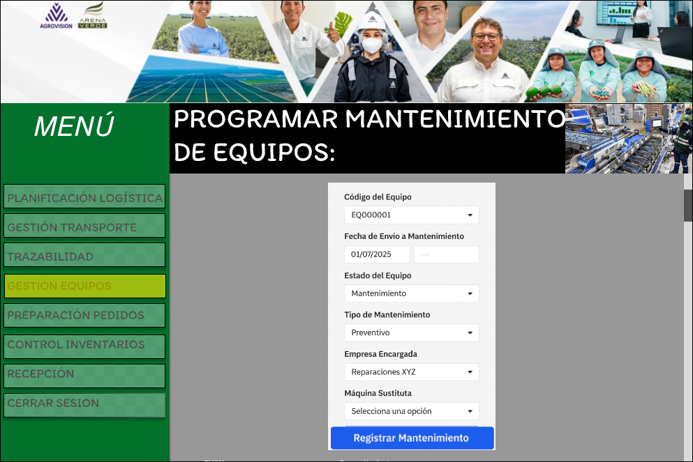

#### EVENTOS:
1. Se carga el formulario con las listas desplegables llenas (código de equipo, estado, tipo de mantenimiento, empresa, máquina sustituta).
2. El usuario selecciona el código del equipo.
3. El usuario ingresa la fecha y hora de envío a mantenimiento.
4. El usuario selecciona el estado del equipo.
5. El usuario selecciona el tipo de mantenimiento.
6. El usuario selecciona la empresa encargada.
7. El usuario selecciona la máquina sustituta (opcional).
8. Se valida que todos los campos obligatorios estén completos y correctos.
9. Se habilita el botón “Registrar Mantenimiento”.
10. Al hacer clic en “Registrar Mantenimiento” se envían los datos para registrar el mantenimiento y se muestra un mensaje de éxito o error.
11. El usuario puede cancelar la acción para cerrar o limpiar el formulario sin guardar.

**Sentencias SQL**
```sql
-- Insertar programación de mantenimiento
INSERT INTO PROG_MANTENIMIENTOS (
    fecha_registro,
    Fecha_de_inicio,
    Empresa_encargada,
    ID_EQUIPOS,
    ID_Estado_mantenimiento,
    ID_Empleado_Registra,
    ID_Empleado_Solicita,
    ID_MAQUINAS_SUSTITUTAS
) VALUES (
    NOW(),
    TO_DATE('2025-07-01', 'YYYY-MM-DD'),
    'Reparaciones XYZ',
    (SELECT ID_EQUIPOS FROM EQUIPOS WHERE COD_EQUIPOS = 'EQ000001'),
    (SELECT ID_Estado_mantenimiento FROM Estado_Mantenimiento WHERE Descripcion = 'Mantenimiento preventivo'),
    1,
    2,
    (SELECT ID_MAQUINAS_SUSTITUTAS FROM MAQUINAS_SUSTITUTAS WHERE COD_MAQUINAS_SUSTITUTAS ='M0000001')
);

-- Actualizar estado del equipo a "Mantenimiento"
UPDATE EQUIPOS
SET ID_Estado_equipo = (SELECT ID_Estado_equipo FROM Estado_Equipo WHERE Descripcion = 'Mantenimiento')
WHERE COD_EQUIPOS = 'EQ000001';
```

**VISUALIZACION DEL MANTENIMIENTO**
**Código Requerimiento:** R-111
**Código Interfaz:** I-111
**Imagen Interfaz**
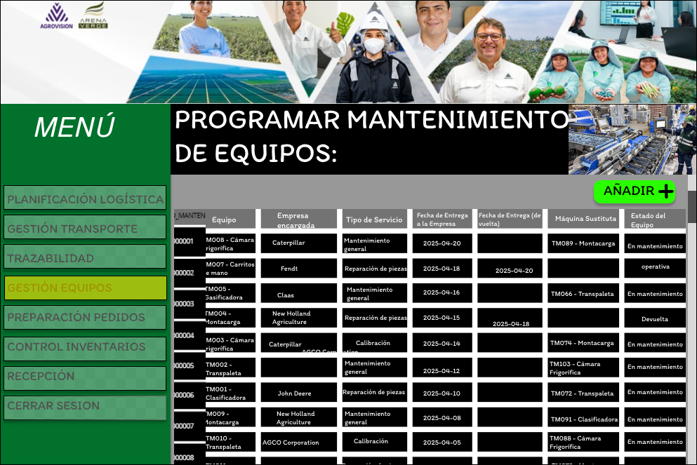
### EVENTOS: 
1. Al abrir la pantalla, se carga y muestra la tabla con los mantenimientos programados: código, equipo, empresa encargada, tipo de servicio, fechas, máquina sustituta y estado.

2. El usuario puede desplazarse verticalmente para revisar todas las filas del mantenimiento.
**Sentencias SQL**
```sql
SELECT
    pm.COD_PROG_MANTENIMIENTOS AS codigo_mantenimiento,
    eq.Nombre_equipo AS equipo,
    pm.Empresa_encargada,
    em.Descripcion AS tipo_servicio,
    pm.Fecha_de_inicio AS fecha_entrega_a_empresa,
    pm.Fecha_de_fin AS fecha_entrega_de_vuelta,
    ms.COD_MAQUINAS_SUSTITUTAS AS maquina_sustituta,
    ee.Descripcion AS estado_equipo

FROM
    PROG_MANTENIMIENTOS pm
JOIN EQUIPOS eq ON pm.ID_EQUIPOS = eq.ID_EQUIPOS
LEFT JOIN Estado_Mantenimiento em ON pm.ID_Estado_mantenimiento = em.ID_Estado_mantenimiento
LEFT JOIN Estado_Equipo ee ON eq.ID_Estado_equipo = ee.ID_Estado_equipo
LEFT JOIN MAQUINAS_SUSTITUTAS ms ON pm.ID_MAQUINAS_SUSTITUTAS = ms.ID_MAQUINAS_SUSTITUTAS

ORDER BY
    pm.COD_PROG_MANTENIMIENTOS;
```

**HISTORIAL  DE EQUIPOS**
**Código Requerimiento:** R-112
**Código Interfaz:** I-112
**Imagen Interfaz**


### EVENTOS:
Claro, aquí tienes los eventos secuenciales para la pantalla de **Historial de Equipos** que muestras:

---

### Eventos secuenciales para Historial de Equipos

1. Al abrir la pantalla, se carga y muestra la tabla con los datos del historial: Equipo, Estado, Cambio de Área, Fecha de Inicio, Fecha de Fin, Máquina Sustituta y Detalle.
2. El usuario puede desplazarse verticalmente para revisar todas las filas del historial.
3. La tabla muestra claramente cada dato en columnas bien definidas para facilitar la lectura.
4. El usuario puede hacer clic en el botón **Descargar PDF** para exportar o guardar el historial completo en formato PDF.
5. Al hacer clic en Descargar, se genera el documento PDF y se descarga automáticamente o se muestra una ventana para guardar el archivo.


**Sentencias SQL**
# ver historial
```sql

SELECT
  rep.COD_REPORTE_EQUIPOS AS "Código Reporte",
  CONCAT(e.COD_EQUIPOS, ' - ', e.Nombre_equipo) AS "Equipo",
  est_eq.Descripcion AS "Estado",

  -- Cambio de área solo para planificación
  CASE
    WHEN rep.ID_PLANIFICACIONES_ASIGNACION IS NOT NULL THEN
      CASE
        WHEN hca.ID_Area_Anterior IS NOT NULL AND hca.ID_Area_Actual IS NOT NULL THEN
          CONCAT(a_ant.Nombre_del_area, ' → ', a_act.Nombre_del_area)
        ELSE ''
      END
    ELSE ''
  END AS "Cambio de Área",

  -- Fecha inicio según tipo
  CASE
    WHEN rep.ID_PLANIFICACIONES_ASIGNACION IS NOT NULL THEN pa.Fecha_de_asignacion
    ELSE pm.Fecha_de_inicio
  END AS "Fecha de Inicio",

  -- Fecha fin: para planificación, o mantenimiento si no fuera de servicio
  CASE
    WHEN rep.ID_PLANIFICACIONES_ASIGNACION IS NOT NULL THEN pa.Fecha_de_vencimiento
    WHEN est_eq.Descripcion = 'Fuera de servicio' THEN NULL
    ELSE pm.Fecha_de_fin
  END AS "Fecha de Fin",

  -- Máquina sustituta solo para mantenimiento activo y no fuera de servicio
  CASE
    WHEN rep.ID_PROG_MANTENIMIENTOS IS NOT NULL AND est_eq.Descripcion <> 'Fuera de servicio' THEN ms.COD_MAQUINAS_SUSTITUTAS
    ELSE ''
  END AS "Máquina Sustituta",

  -- Detalle según tipo y estado
  CASE
    WHEN rep.ID_PLANIFICACIONES_ASIGNACION IS NOT NULL THEN pa.Descripcion_de_tarea
    WHEN est_eq.Descripcion = 'Fuera de servicio' THEN 'Malogrado, espera reparación'
    ELSE COALESCE(md.Detalle_mantenimiento_realizado, em.Descripcion, '')
  END AS "Detalle"

FROM REPORTE_EQUIPOS rep
JOIN EQUIPOS e ON rep.ID_EQUIPOS = e.ID_EQUIPOS
LEFT JOIN Estado_Equipo est_eq ON e.ID_Estado_equipo = est_eq.ID_Estado_equipo

LEFT JOIN Historial_Cambios_Area hca ON e.ID_EQUIPOS = hca.ID_EQUIPOS
LEFT JOIN Area a_ant ON hca.ID_Area_Anterior = a_ant.ID_Area
LEFT JOIN Area a_act ON hca.ID_Area_Actual = a_act.ID_Area

LEFT JOIN PLANIFICACIONES_ASIGNACION pa ON rep.ID_PLANIFICACIONES_ASIGNACION = pa.ID_PLANIFICACIONES_ASIGNACION
LEFT JOIN PROG_MANTENIMIENTOS pm ON rep.ID_PROG_MANTENIMIENTOS = pm.ID_PROG_MANTENIMIENTOS
LEFT JOIN Estado_Mantenimiento em ON pm.ID_Estado_mantenimiento = em.ID_Estado_mantenimiento
LEFT JOIN MAQUINAS_SUSTITUTAS ms ON pm.ID_MAQUINAS_SUSTITUTAS = ms.ID_MAQUINAS_SUSTITUTAS
LEFT JOIN Mantenimiento_detalle md ON pm.ID_PROG_MANTENIMIENTOS = md.ID_PROG_MANTENIMIENTOS

ORDER BY "Fecha de Inicio"  NULLS LAST, "Código Reporte";
```

## Modulo 2 Gestion de Inventario
**Caso 1**

| Codigo Requerimiento | R201                                                                                      |
| -------------------- | ----------------------------------------------------------------------------------------- |
| Codigo Interfaz      | I201                                                                                      |
| Imagen Interfaz      | |

Eventos:

1. Botón **Registro de Movimientos** : Al presionar el botón llevará a la interfaz I202.
2. Botón **Control de Stock** : Al presionar el botón llevará a la interfaz I204.
3. Botón **Reportes de Inventario** : Al presionar el botón llevará a la interfaz I206.


**Caso 2**
|Codigo Requerimiento |R202|
|---|---|
|Codigo Interfaz| I202|
|Imagen Interfaz| |

Eventos:

0. Carga de pagina:

```sql
SELECT
    mi.cod_movimiento_inventario,
    mi.fecha_movimiento,
    tm.descripcion AS tipo_movimiento,
    mi.motivo,
    l.cod_lote,
    l.descripcion AS descripcion_lote,
    mi.origen,
    mi.destino,
    mi.id_empleado
FROM
    Movimiento_inventario mi
JOIN
    Lote l ON mi.id_lote = l.id_lote
JOIN
    Producto p ON mi.id_producto = p.id_producto
JOIN
    Tipo_Movimiento tm ON mi.id_tipo_movimiento = tm.id_tipo_movimiento
ORDER BY
    mi.fecha_movimiento DESC;

```

1. Filtros:

Movimientos más antiguos (orden ascendente por fecha)
```sql
SELECT *
FROM Movimiento_inventario
ORDER BY fecha_movimiento ASC
LIMIT 100;  -- o la cantidad que quieras mostrar
```
Solo movimientos de salida
```sql
SELECT *
FROM Movimiento_inventario
WHERE id_tipo_movimiento = 'S'
ORDER BY fecha_movimiento DESC;
```
Solo movimientos de entrada
```sql
SELECT *
FROM Movimiento_inventario
WHERE id_tipo_movimiento = 'E'
ORDER BY fecha_movimiento DESC;
```

2. Nuevo Movimiento: Dirige a la interfaz I203

**Caso 3**

| Codigo Requerimiento | R203                                                                                      |
| -------------------- | ----------------------------------------------------------------------------------------- |
| Codigo Interfaz      | I203                                                                                      |
| Imagen Interfaz      ||

Eventos:

1. Boton Cancelar: Vuelve a la Interfaz I202
2. Boton Registrar: (Se le asocia la funcion trg_before_insert_movimiento)
```sql
INSERT INTO Movimiento_inventario (
    id_tipo_movimiento,
    motivo,
    cantidad,
    fecha_movimiento,       -- opcional, si no lo pones usa default NOW()
    id_lote,
    id_empleado,
    origen,
    destino
) VALUES (
    'E',                    -- tipo movimiento ('E' o 'S')
    'Ingreso por compra',   -- motivo
    50,                     -- cantidad
    NOW(),                  -- fecha actual (puedes cambiar)
    1,                    -- id_lote (debe existir)
    2,                     -- id_empleado (quien realiza movimiento)
    'Proveedor X',          -- origen
    'Almacén Principal'     -- destino
);
```

**Caso 4**

| Codigo Requerimiento | R204                                                                                      |
| -------------------- | ----------------------------------------------------------------------------------------- |
| Codigo Interfaz      | I204                                                                                      |
| Imagen Interfaz      ||
   
Eventos:

0. Carga de Pagina:
```sql
   SELECT
    p.nombre_producto,
    COALESCE(SUM(CASE WHEN mi.id_tipo_movimiento = 'E' THEN mi.cantidad
                      WHEN mi.id_tipo_movimiento = 'S' THEN -mi.cantidad
                 END), 0) AS stock_disponible,
    s.stock_minimo,
    s.stock_maximo
FROM
    Producto p
LEFT JOIN
    Stock s ON p.id_producto = s.id_producto
LEFT JOIN
    Movimiento_inventario mi ON p.id_producto = mi.id_producto
GROUP BY
    p.nombre_producto, s.stock_minimo, s.stock_maximo
ORDER BY
    p.nombre_producto;
```

2. Minimo Stock:
```sql
UPDATE Stock
SET
    stock_minimo = :nuevo_stock_minimo
WHERE
    id_producto = :id_producto;
```

3. Maximo Stock:
```sql
UPDATE Stock
SET
    stock_maximo = :nuevo_stock_maximo
WHERE
    id_producto = :id_producto;
```

4. Alertas: Al presionar el botón llevará a la interfaz I205

**Caso 5**

| Codigo Requerimiento | R205                                                                                      |
| -------------------- | ----------------------------------------------------------------------------------------- |
| Codigo Interfaz      | I205                                                                                      |
| Imagen Interfaz      ||

Eventos:

0. Carga de Pagina:
```sql
SELECT
    ai.id_alerta_inventario,
    ai.cod_alerta_inventario,
    ai.estado_alerta,
    ai.tipo_alerta,
    ai.severidad,
    ai.descripcion,
    ai.fecha_hora_alerta,
    ai.fecha_hora_solucion,
    l.cod_lote,
    ri.cod_reporte_inventario,
    e.id_empleado
FROM
    Alerta_inventario ai
LEFT JOIN
    Lote l ON ai.id_lote = l.id_lote
LEFT JOIN
    Reporte_inventario ri ON ai.id_reporte_inventario = ri.id_reporte_inventario
LEFT JOIN
    Empleado e ON ai.id_empleado_responsable = e.id_empleado
ORDER BY
    ai.fecha_hora_alerta DESC;
```

**Caso 6**

| Codigo Requerimiento | R206                                                                                      |
| -------------------- | ----------------------------------------------------------------------------------------- |
| Codigo Interfaz      | I206                                                                                      |
| Imagen Interfaz      ||

Eventos:

0. Carga de Pagina:
```sql
SELECT
    ri.cod_reporte_inventario,
    ri.fecha_inventario,
    rid.id_detalle,
    rid.id_lote,
    rid.cantidad_esperada,
    rid.cantidad_real,
    rid.diferencia,
    rid.observacion
FROM
    Reporte_inventario ri
JOIN
    Reporte_inventario_detalle rid
    ON ri.id_reporte_inventario = rid.id_reporte_inventario
ORDER BY
    ri.fecha_inventario DESC, ri.id_reporte_inventario, rid.id_detalle;
```

1. Registrar Nuevo Reporte de Inventario: Al presionar el botón llevará a la interfaz I207

2. Boton Nuevo Reporte de Inventario: Crea un nuevo Reporte a la fecha actual
```sql
INSERT INTO Reporte_inventario (
    fecha_inventario
) VALUES (
    CURRENT_DATE         -- Fecha actual
);
```

**Caso 7**

| Codigo Requerimiento | R207                                                                                      |
| -------------------- | ----------------------------------------------------------------------------------------- |
| Codigo Interfaz      | I207                                                                                      |
| Imagen Interfaz      |   |


Eventos:

1. Boton cancelar: Regresa a la interfaz I206

2. Registrar Nuevo Reporte de Inventario detalle a un reporte de Inventario ya existente:
```sql
INSERT INTO Reporte_inventario_detalle (
    id_reporte_inventario,
    id_lote,
    cantidad_esperada,
    cantidad_real,
    observacion
) VALUES (
    123,          -- Reemplaza con el id del reporte existente
    456,          -- Reemplaza con el id del lote
    100.0,        -- Cantidad esperada
    95.0,         -- Cantidad real
    'Observación ejemplo'  -- Texto opcional
);
```


## Modulo 3 Preparacion de pedidos


**Caso 1**

| Codigo Requerimiento | R301                                                                                      |
| -------------------- | ----------------------------------------------------------------------------------------- |
| Codigo Interfaz      | I301                                                                                      |
| Imagen Interfaz      | |

Eventos:

1. Botón **Listas de picking** : Al presionar el botón se le llevará a la interfaz I302.
2. Botón **Generación de Reporte** : Al presionar el botón se le llevará a la interfaz I305.


**Caso 2**
|Codigo Requerimiento |R302|
|---|---|
|Codigo Interfaz| I302|
|Imagen Interfaz| 
|

Eventos:

0. Carga de pagina:

```sql
SELECT
    pe.cod_pedido          AS "PEDIDO",
    em.nombre_apellido     AS "NOMBRE_EMPLEADO",
    pe.fecha_limite        AS "FECHA_LIMITE",
    pe.destino             AS "DESTINO",
    ep.descripcion         AS "ESTADO"
FROM
    Pedido pe
    INNER JOIN Packing pk ON pe.id_pedido = pk.id_pedido
    INNER JOIN Empleado em ON pk.id_empleado = em.id_empleado
    INNER JOIN Estado_packing ep ON pk.id_estado_packing = ep.id_estado_packing

```

1. Barra de busqueda:

```sql
SELECT
    pe.cod_pedido          AS "PEDIDO",
    em.nombre_apellido     AS "NOMBRE_EMPLEADO",
    pe.fecha_limite        AS "FECHA_LIMITE",
    pe.destino             AS "DESTINO",
    ep.descripcion         AS "ESTADO"
FROM
    Pedido pe
    INNER JOIN Packing pk ON pe.id_pedido = pk.id_pedido
    INNER JOIN Empleado em ON pk.id_empleado = em.id_empleado
    INNER JOIN Estado_packing ep ON pk.id_estado_packing = ep.id_estado_packing
WHERE
    pe.cod_pedido LIKE '% ! %'  
ORDER BY
    pe.cod_pedido;

```


**Caso 3**

| Codigo Requerimiento | R303                                                                                      |
| -------------------- | ----------------------------------------------------------------------------------------- |
| Codigo Interfaz      | I303                                                                                      |
| Imagen Interfaz      |  |

Eventos:

0. Carga de pagina:

```sql

SELECT
    pr.id_producto           AS "ID_PRODUCTO",
    pr.nombre_producto       AS "PRODUCTO",
    SUM(pk.cantidad_producto) AS "CANTIDAD",
    MAX(ar.id_area)          AS "AREA", -- o MIN, según prefieras
    MAX(ep.descripcion)      AS "ESTADO" -- si hay varios estados, elige uno
FROM
    Packing pk
    INNER JOIN Empaque emq ON pk.id_empaque = emq.id_empaque
    INNER JOIN Lote l ON emq.id_lote = l.id_lote
    INNER JOIN Producto pr ON l.id_producto = pr.id_producto
    INNER JOIN Empleado em ON pk.id_empleado = em.id_empleado
    INNER JOIN PLANIFICACIONES_ASIGNACION pa ON em.id_empleado = pa.ID_Empleado_Solicita
    INNER JOIN Area ar ON pa.ID_Area = ar.id_area
    INNER JOIN Estado_packing ep ON pk.id_estado_packing = ep.id_estado_packing

GROUP BY
    pr.id_producto,
    pr.nombre_producto
ORDER BY
    pr.id_producto ASC;


```

1. Barra de busqueda:

```sql
SELECT
    pr.id_producto           AS "ID_PRODUCTO",
    pr.nombre_producto       AS "PRODUCTO",
    SUM(pk.cantidad_producto) AS "CANTIDAD",
    MAX(ar.id_area)          AS "AREA", -- o MIN, según prefieras
    MAX(ep.descripcion)      AS "ESTADO" -- si hay varios estados, elige uno
FROM
    Packing pk
    INNER JOIN Empaque emq ON pk.id_empaque = emq.id_empaque
    INNER JOIN Lote l ON emq.id_lote = l.id_lote
    INNER JOIN Producto pr ON l.id_producto = pr.id_producto
    INNER JOIN Empleado em ON pk.id_empleado = em.id_empleado
    INNER JOIN PLANIFICACIONES_ASIGNACION pa ON em.id_empleado = pa.ID_Empleado_Solicita
    INNER JOIN Area ar ON pa.ID_Area = ar.id_area
    INNER JOIN Estado_packing ep ON pk.id_estado_packing = ep.id_estado_packing
WHERE
    pr.id_producto LIKE '% ! %'
GROUP BY
    pr.id_producto,
    pr.nombre_producto
ORDER BY
    pr.id_producto ASC;

```


**Caso 4**

| Codigo Requerimiento | R304                                                                                      |
| -------------------- | ----------------------------------------------------------------------------------------- |
| Codigo Interfaz      | I304                                                                                      |
| Imagen Interfaz      |  |


Eventos:

1. Boton Cancelar: Vuelve a la interfaz I303


2. Boton Agregar:

```sql
INSERT INTO Empaque (nombre, id_tipo_empaque, descripcion, capacidad_maxima, ID_Lote) VALUES
( 'Parihuela', 'P', 'Parihuela especial para arándano', 500.0, 1);


```


**Caso 5**

| Codigo Requerimiento | R305                                                                                      |
| -------------------- | ----------------------------------------------------------------------------------------- |
| Codigo Interfaz      | I305                                                                                      |
| Imagen Interfaz      |  |

Eventos:

0. Carga de pagina:

```sql
SELECT 
    rp.cod_reporte_packing AS "COD REPORTE PACKING",
    pk.Fecha_packing AS "FECHA PACKING",
    pk.ID_Empleado AS "COD EMPLEADO",
    pr.Nombre_producto AS "PRODUCTO",
    pk.Cantidad_producto AS "CANTIDAD",
    te.Descripcion AS "TIPO EMPAQUE",
    l.ID_lote AS "LOTE",
    rp.Observaciones AS "OBSERVACION PACKING"
FROM Packing pk
JOIN Pedido p ON pk.ID_Pedido = p.ID_Pedido
JOIN Empaque e ON pk.ID_empaque = e.ID_empaque
JOIN Tipo_empaque te ON e.ID_Tipo_empaque = te.ID_Tipo_empaque
JOIN Lote l ON e.ID_Lote = l.ID_lote
JOIN Producto pr ON l.ID_producto = pr.ID_producto
LEFT JOIN Reporte_Packing rp ON pk.ID_packing = rp.ID_packing
ORDER BY pk.Fecha_packing DESC;


```

1. Barra de busqueda:

```sql
SELECT 
    rp.cod_reporte_packing AS "COD REPORTE PACKING",
    pk.Fecha_packing AS "FECHA PACKING",
    pk.ID_Empleado AS "COD EMPLEADO",
    pr.Nombre_producto AS "PRODUCTO",
    pk.Cantidad_producto AS "CANTIDAD",
    te.Descripcion AS "TIPO EMPAQUE",
    l.ID_lote AS "LOTE",
    rp.Observaciones AS "OBSERVACION PACKING"
FROM Packing pk
JOIN Pedido p ON pk.ID_Pedido = p.ID_Pedido
JOIN Empaque e ON pk.ID_empaque = e.ID_empaque
JOIN Tipo_empaque te ON e.ID_Tipo_empaque = te.ID_Tipo_empaque
JOIN Lote l ON e.ID_Lote = l.ID_lote
JOIN Producto pr ON l.ID_producto = pr.ID_producto
LEFT JOIN Reporte_Packing rp ON pk.ID_packing = rp.ID_packing
WHERE rp.cod_reporte_packing LIKE '%RPK00%'
ORDER BY pk.Fecha_packing DESC;


```
2. Boton Descargar Pdf: Permite descargar el reporte en formato PDF.


## Modulo 4 Gestion de Recepcion

**Caso 1**

| Codigo Requerimiento | R401                                                                                      |
| -------------------- | ----------------------------------------------------------------------------------------- |
| Codigo Interfaz      | I401                                                                                      |
| Imagen Interfaz      |  |

Eventos:

1. Botón **Registro de lotes y recepcion** : Al presionar el botón se le llevará a la interfaz I4.
2. Botón **Control de calidad** : Al presionar el botón se le llevará a la interfaz I4.
3. Botón **Generacion de reportes de recepcion** : Al presionar el botón se le llevará a la interfaz I4.


**Caso 2**
|Codigo Requerimiento |R402|
|---|---|
|Codigo Interfaz| I402|
|Imagen Interfaz| |

Eventos:

0. Carga de pagina:

```sql
SELECT
    l.cod_lote,
    p.nombre_producto,
    tl.descripcion AS tipo_del_lote,
    l.fecha_produccion,
    l.cantidad_total AS cantidad,
    l.unidad,
    el.descripcion AS estado_lote
FROM
    Lote l
INNER JOIN Producto p ON l.id_producto = p.id_producto
INNER JOIN Tipo_Lote tl ON l.id_tipo_lote = tl.id_tipo_lote
INNER JOIN Estado_Lote el ON l.id_estado_lote = el.id_estado_lote;

```

1. Barra de busqueda (por descripcion):

```sql
SELECT
    l.cod_lote,
    p.nombre_producto,
    tl.descripcion AS tipo_del_lote,
    l.fecha_produccion,
    l.cantidad_total AS cantidad,
    l.unidad,
    el.descripcion AS estado_lote
FROM
    Lote l
INNER JOIN Producto p ON l.id_producto = p.id_producto
INNER JOIN Tipo_Lote tl ON l.id_tipo_lote = tl.id_tipo_lote
INNER JOIN Estado_Lote el ON l.id_estado_lote = el.id_estado_lote
WHERE
    p.nombre_producto ILIKE '%' || 'Arándano' || '%';
```

2. Filtro por estado lote:

```sql
SELECT
    l.cod_lote,
    p.nombre_producto,
    tl.descripcion AS tipo_del_lote,
    l.fecha_produccion,
    l.cantidad_total AS cantidad,
    l.unidad,
    el.descripcion AS estado_lote
FROM
    Lote l
INNER JOIN Producto p ON l.id_producto = p.id_producto
INNER JOIN Tipo_Lote tl ON l.id_tipo_lote = tl.id_tipo_lote
INNER JOIN Estado_Lote el ON l.id_estado_lote = el.id_estado_lote
WHERE
    l.id_estado_lote = 'OB';
```


3. Boton Nuevo: dirige a la Interfaz I403
4. Boton + : Dirige a la Interfaz I404

**Caso 3**

| Codigo Requerimiento | R403                                                                                      |
| -------------------- | ----------------------------------------------------------------------------------------- |
| Codigo Interfaz      | I403                                                                                      |
| Imagen Interfaz      |  |

Eventos:

1. Boton Cancelar: Vuelve a la Interfaz I402
2. Boton Añadir:
```sql
INSERT INTO Lote (cod_lote, id_tipo_lote, cantidad_total, unidad, fecha_vencimiento, id_estado_lote, fecha_produccion, id_producto) VALUES
(?, ?, ?, ?, ?, ?, ?, ?);
```
Y regresa a la Interfaz I401

**Caso 4**

| Codigo Requerimiento | R404                                                                                      |
| -------------------- | ----------------------------------------------------------------------------------------- |
| Codigo Interfaz      | I404                                                                                      |
| Imagen Interfaz      |  |

Eventos:
0. Cargar datos a Mostrar:
```sql
SELECT 
    L.cod_lote,
    P.nombre_producto,
    L.cantidad_total AS cantidad,
    L.unidad
FROM 
    Lote L
JOIN 
    Producto P ON L.id_producto = P.id_producto
WHERE 
    L.id_lote = 20;
```
1. Boton 'X': Vuelve a la Interfaz I402
2. Boton 'Aprobado': Agrega lo insertado por el usuario, con el estado Aprobado
```sql
INSERT INTO Recepcion (
    fecha_registro,
    cantidad_recibida,
    id_estado_recepcion,
    observaciones,
    id_lote
)
VALUES (CURRENT_DATE,10000,'A', NULL, 21);
```
3. Boton 'Observado': Agrega lo insertado por el usuario, con el estado Aprobado
```sql
INSERT INTO Recepcion (
    fecha_registro,
    cantidad_recibida,
    id_estado_recepcion,
    observaciones,
    id_lote
)
VALUES (
    CURRENT_DATE, :cantidad_recibida,
    'O',  
    :observaciones,
    :id_lote
);
```
**Caso 5**

| Codigo Requerimiento | R405                                                                                      |
| -------------------- | ----------------------------------------------------------------------------------------- |
| Codigo Interfaz      | I405                                                                                      |
| Imagen Interfaz      |  |

Eventos:
0. Cargar datos a Mostrar:
```sql
SELECT
    r.cod_recepcion,
    p.nombre_producto,
    tl.descripcion AS descripcion_lote,
    l.cantidad_total AS cantidad,
    l.unidad AS unidad,
    er.descripcion AS estado_recepcion
FROM
    Recepcion r
JOIN
    Lote l ON r.id_lote = l.id_lote
JOIN
    Producto p ON l.id_producto = p.id_producto
JOIN
    Tipo_Lote tl ON l.id_tipo_lote = tl.id_tipo_lote
JOIN
    Estado_Recepcion er ON r.id_estado_recepcion = er.id_estado_recepcion
WHERE
    r.id_estado_recepcion = 'A';
```
1. Barra de busqueda (por producto):
```sql
SELECT
    r.cod_recepcion,
    p.nombre_producto,
    tl.descripcion AS descripcion_lote,
    l.cantidad_total AS cantidad,
    l.unidad AS unidad,
    er.descripcion AS estado_recepcion
FROM
    Recepcion r
JOIN
    Lote l ON r.id_lote = l.id_lote
JOIN
    Producto p ON l.id_producto = p.id_producto
JOIN
    Tipo_Lote tl ON l.id_tipo_lote = tl.id_tipo_lote
JOIN
    Estado_Recepcion er ON r.id_estado_recepcion = er.id_estado_recepcion
WHERE
    r.id_estado_recepcion = 'A'
    AND p.nombre_producto ILIKE '%' || 'Kiwi' || '%';

```
2. Boton '+': Dirige a la siguiente interfaz I406

**Caso 6**


| Codigo Requerimiento | R406                                                                                      |
| -------------------- | ----------------------------------------------------------------------------------------- |
| Codigo Interfaz      | I406                                                                                      |
| Imagen Interfaz      |  |

Eventos:
0. Cargar datos a Mostrar:
```sql
SELECT 
    r.cod_recepcion
FROM 
    Recepcion r
WHERE 
    r.cod_recepcion = 'REC00021';
```
1. Boton 'X': Regresas a la interfaz I405
2. Boton 'aprobado':
```sql
INSERT INTO Control_de_calidad (
    fecha_inspeccion,
    id_estado_paquete_recepcion,
    temperatura_producto,
    observaciones_lote,
    observaciones_empaque,
    id_estado_control_calidad,
    id_recepcion,
    id_empleado
)
VALUES (
    CURRENT_DATE,
    :id_estado_paquete_recepcion,
    :temperatura_producto,
    NULL,
    NULL,
    'A',              -- Estado Aprobado
    :id_recepcion,
    :id_empleado
);

```

3. Boton 'observado':
```sql
INSERT INTO Control_de_calidad (
    fecha_inspeccion,
    id_estado_paquete_recepcion,
    temperatura_producto,
    observaciones_lote,
    observaciones_empaque,
    id_estado_control_calidad,
    id_recepcion,
    id_empleado
)
VALUES (
    CURRENT_DATE,
    :id_estado_paquete_recepcion,
    :temperatura_producto,
    :observaciones_lote,
    :observaciones_empaque,
    'O',             
    :id_recepcion,
    :id_empleado
);

```
**Caso 7**


| Codigo Requerimiento | R407                                                                                      |
| -------------------- | ----------------------------------------------------------------------------------------- |
| Codigo Interfaz      | I407                                                                                      |
| Imagen Interfaz      |  |

Eventos:
0. Cargar datos a Mostrar:
```sql
SELECT
    cc.cod_control_calidad,
    p.nombre_producto,
    tl.descripcion AS descripcion_lote,
    l.cantidad_total,
    l.unidad,
    ecc.descripcion AS estado_control_calidad
FROM
    Control_de_calidad cc
JOIN
    Recepcion r ON cc.id_recepcion = r.ID_recepcion
JOIN
    Lote l ON r.id_lote = l.id_lote
JOIN
    Producto p ON l.id_producto = p.id_producto
JOIN
    Tipo_Lote tl ON l.id_tipo_lote = tl.id_tipo_lote
JOIN
    Estado_Control_Calidad ecc ON cc.id_estado_control_calidad = ecc.id_estado_control_calidad
WHERE
    cc.id_estado_control_calidad = 'O';  -- Observado

```
1. Barra busqueda
```sql
SELECT
    cc.cod_control_calidad,
    p.nombre_producto,
    tl.descripcion AS descripcion_lote,
    l.cantidad_total,
    l.unidad,
    ecc.descripcion AS estado_control_calidad
FROM
    Control_de_calidad cc
JOIN
    Recepcion r ON cc.id_recepcion = r.ID_recepcion
JOIN
    Lote l ON r.id_lote = l.id_lote
JOIN
    Producto p ON l.id_producto = p.id_producto
JOIN
    Tipo_Lote tl ON l.id_tipo_lote = tl.id_tipo_lote
JOIN
    Estado_Control_Calidad ecc ON cc.id_estado_control_calidad = ecc.id_estado_control_calidad
WHERE
    cc.id_estado_control_calidad = 'O'
    AND p.nombre_producto ILIKE '%' || 'uva' || '%';
``` 
2. Boton '+': dirige a la siguiente interfaz I408
3. Boton ' ver estadisticas': dirige a la siguiente interfaz I409
4. Boton '<--' : Regresa a la interfaz I401


**Caso 8**


| Codigo Requerimiento | R408                                                                                      |
| -------------------- | ----------------------------------------------------------------------------------------- |
| Codigo Interfaz      | I408                                                                                      |
| Imagen Interfaz      |  |
Eventos:
0. Cargar datos a Mostrar:
```sql
SELECT 
    l.cod_lote,
    p.nombre_producto
FROM 
    Control_de_calidad cc
JOIN 
    Recepcion r ON cc.id_recepcion = r.id_recepcion
JOIN 
    Lote l ON r.id_lote = l.id_lote
JOIN 
    Producto p ON l.id_producto = p.id_producto
WHERE 
    cc.id_control_de_calidad = '2';

```

1. Boton 'X': regresa a la interfaz I407
2. Boton Registrar:
```sql

INSERT INTO reporte_producto_observado (
    fecha_registro,
    especificacion_no_cumplida,
    acciones_a_tomar,
    id_control_de_calidad
)
VALUES (
    CURRENT_DATE,
   'nose pero no cumple',
    'Rechaz lote',
    15
);
```

**Caso 9**


| Codigo Requerimiento | R409                                                                                      |
| -------------------- | ----------------------------------------------------------------------------------------- |
| Codigo Interfaz      | I409                                                                                      |
| Imagen Interfaz      | |

Eventos:
0. Cargar datos a Mostrar:
Segun Tipo_producto:
```sql
SELECT 
    p.nombre_producto,
    COUNT(*) AS total_recepciones
FROM 
    Recepcion r
JOIN 
    Lote l ON r.id_lote = l.id_lote
JOIN 
    Producto p ON l.id_producto = p.id_producto
JOIN 
    Tipo_Producto tp ON p.id_tipo_producto = tp.id_tipo_producto
GROUP BY 
    p.nombre_producto
ORDER BY 
    total_recepciones DESC;

```
Segun Mes:
```sql
SELECT 
    DATE_TRUNC('month', fecha_registro) AS mes,
    COUNT(*) AS total_recepciones
FROM 
    Recepcion
WHERE 
    fecha_registro >= DATE '2024-05-01'
    AND fecha_registro < DATE '2024-06-01'
GROUP BY 
    DATE_TRUNC('month', fecha_registro)
ORDER BY 
    mes;
```
1. Boton 'X': regresa a la interfaz I407
## Modulo 5 Gestion de Transporte
CASO 1

|Codigo Requerimiento |R501|
|---|---|
|Codigo Interfaz| I501|
|Imagen Interfaz| |

EVENTOS:
1. Boton de registro de ordenes de transporte
2. Boton de seguimiento de transporte
3. Boton de generacion de guias de remision
4. Boton de generacion de informes de entrega
5. Boton de reporte de incidentes de entrega

CASO 2

|Codigo Requerimiento |R502|
|---|---|
|Codigo Interfaz| I502|
|Imagen Interfaz| |

EVENTOS:
  0. Carga de pagina
  ```sql
  SELECT o.cod_orden_transporte, e.cod_empleado, o.fecha_salida, o.hora_salida, 
  o.fecha_finalizado AS Fecha_finalizada, eo.descripcion FROM empleado e INNER JOIN orden_transporte o ON e.id_empleado = o.id_empleado  
  INNER JOIN estado_orden_transporte eo ON o.id_estado_orden = eo.id_estado_orden

  ```
  1. BUSCAR POR ORDEN DE TRANSPORTE
  ```sql
  SELECT o.cod_orden_transporte, e.cod_empleado, o.fecha_salida, o.hora_salida, 
  o.fecha_finalizado AS Fecha_finalizada, eo.descripcion FROM empleado e INNER JOIN orden_transporte o ON e.id_empleado = o.id_empleado  
  INNER JOIN estado_orden_transporte eo ON o.id_estado_orden = eo.id_estado_orden
  WHERE o.cod_orden_transporte = 'OT000001'
  ``` 
  2. FILTRAR POR ESTADO DE LA ORDEN DE TRANSPORTE
  ```sql
  SELECT o.cod_orden_transporte, e.cod_empleado, o.fecha_salida, o.hora_salida, 
  o.fecha_finalizado AS Fecha_finalizada, eo.descripcion FROM empleado e INNER JOIN orden_transporte o ON e.id_empleado = o.id_empleado  
  INNER JOIN estado_orden_transporte eo ON o.id_estado_orden = eo.id_estado_orden
  WHERE eo.id_estado_orden = 'P'
  ``` 
  3. Boton Nuevo: DIRIGE A LA INTERFA I503
  4. Boton Visualizar seguimiento: DIRIGE A LA INTERFAZ I504

CASO 3
|Codigo Requerimiento |R503|
|---|---|
|Codigo Interfaz| I503|
|Imagen Interfaz| |

EVENTOS:
  0. Añadir una nueva orden de transporte
  ```sql
  INSERT INTO orden_transporte (id_empleado,cod_orden_transporte, fecha_finalizado, fecha_salida, hora_salida) 
  SELECT id_empleado, 'OT000012', NULL, '2025-08-19','12:30:00' FROM Empleado WHERE cod_empleado = 'EMP00001'
  ```
  Agregar a la entidad relacion guia_x_orden_transporte
  ```sql
  INSERT INTO guia_x_orden_transporte (id_orden_transporte, id_guia_remision) 
  SELECT id_orden_transporte, id_guia_remision FROM orden_transporte o, guia_de_remision g 
  WHERE o.cod_orden_transporte = 'OT000012' AND g.cod_guia_remision = 'GR000001'
  SELECT * FROM GUIA_X_ORDEN_TRANSPORTE  
  DELETE FROM GUIA_X_ORDEN_TRANSPORTE WHERE id_orden_transporte = (SELECT id_orden_transporte FROM orden_transporte WHERE cod_orden_transporte = 'OT000012') 
  ``` 
CASO 4
|Codigo Requerimiento |R504|
|---|---|
|Codigo Interfaz| I504|
|Imagen Interfaz|  |

EVENTOS:
  0. Mostrar tabla
  ```sql
  SELECT t1.cod_orden_transporte, t1.cod_empleado, t2.descripcion, t2.fecha_registro, t2.hora_registro, t2.estado
  FROM (SELECT DISTINCT o.cod_orden_transporte, e.cod_empleado FROM guia_x_orden_transporte gxo 
  INNER JOIN orden_transporte o ON gxo.id_orden_transporte = o.id_orden_transporte   
  INNER JOIN guia_de_remision g ON gxo.id_guia_remision = g.id_guia_remision
  INNER JOIN empleado e ON g.id_transportista = e.id_empleado ORDER BY o.cod_orden_transporte) t1

  INNER JOIN (SELECT o.cod_orden_transporte as orden_transporte, s.descripcion, s.fecha_registro, s.hora_registro, es.descripcion as estado FROM orden_transporte o
  INNER JOIN seguimiento s ON o.id_orden_transporte = s.id_orden_transporte
  INNER JOIN estado_seguimiento es ON s.id_estado_seguimiento = es.id_estado_seguimiento) t2 ON t1.cod_orden_transporte = t2.orden_transporte
  ```
  1. BUSCAR POR DESCRIPCION. NOTA: SE ESTA USANDO LA VISTA DE LA ANTERIOR TABLA
  ```sql
  SELECT * FROM vista_seguimiento_ordenes_transporte
  WHERE
  descripcion ILIKE '%' || 'Ica' || '%';
  ```
  2. Buscar por codigo de orden_transporte
  ```sql
  SELECT * FROM vista_seguimiento_ordenes_transporte
  WHERE
  cod_orden_transporte = 'OT000001'
  ```
  3. Filtrar por estado
  ```sql
  SELECT * FROM vista_seguimiento_ordenes_transporte
  WHERE
  estado = 'En tránsito'
  ```
  4. Boton de registro de nuevo seguimiento

Caso 5
|Codigo Requerimiento |R505|
|---|---|
|Codigo Interfaz| I505|
|Imagen Interfaz||
EVENTOS:
  0. Insertar datos a la tabla:
  ```sql
  INSERT INTO seguimiento (descripcion, id_estado_seguimiento, id_orden_transporte) 
  SELECT 'DIRECCION A', 'T', id_orden_transporte FROM orden_transporte WHERE cod_orden_transporte = 'OT000011' 
  SELECT * FROM seguimiento
  ```
  1. Boton cancelar, te devuelve a la interfaz anterior

CASO 6
|Codigo Requerimiento |R506|
|---|---|
|Codigo Interfaz| I506|
|Imagen Interfaz||
Eventos:
  0. Mostrar la tabla
  ```sql
    SELECT g.cod_guia_remision, e.cod_empleado, ie.nombre_receptor,ie.dni_receptor, ie.fecha_entrega, ie.hora_entrega, ie.observacion FROM informe_entrega ie
    INNER JOIN guia_de_remision g ON g.id_guia_remision = ie.id_guia_remision
    INNER JOIN empleado e ON e.id_empleado = g.id_transportista
  ```
  1. Boton buscar por codigo de guia: NOTA: SE UTILIZARA LA VISTA, DE LA ANTERIOR TABLA
  ```sql
    SELECT * FROM vista_informe_entrega WHERE cod_guia_remision = 'GR000001'
  ```
  2. Boton nuevo, te manda a la siguiente interfaz (I507)

Caso 7
|Codigo Requerimiento |R507|
|---|---|
|Codigo Interfaz| I507|
|Imagen Interfaz|  |
EVENTOS:
  0. Boton añadir:
  ```sql
    INSERT INTO informe_entrega(nombre_receptor,dni_receptor,observacion,id_guia_remision) 
    VALUES('JUAN PEREZ', '12345678', 'Conforme',(SELECT id_guia_remision FROM guia_de_remision WHERE cod_guia_remision = 'GR000010'))
    SELECT * FROM informe_entrega
  ```
  1. Boton cancelar, te devuelve a la anterior interfaz

Caso 8
|Codigo Requerimiento |R508|
|---|---|
|Codigo Interfaz| I508 |
|Imagen Interfaz||
EVENTOS:
  0. Mostrar tabla:
  ```sql
    SELECT g.cod_guia_remision, e.cod_empleado, c.cod_cliente, rie.nombre_realiza, rie.dni_realiza, rie.fecha_registro, rie.hora_registro, eri.descripcion as estado, rie.descripcion
    FROM reporte_incidentes_entrega rie
    INNER JOIN informe_entrega ie ON ie.id_informe_entrega = rie.id_informe_entrega
    INNER JOIN guia_de_remision g ON g.id_guia_remision = ie.id_guia_remision
    INNER JOIN empleado e ON e.id_empleado = rie.id_empleado
    INNER JOIN cliente c ON c.id_cliente = rie.id_cliente
    INNER JOIN estado_reporte_incidentes_transporte eri ON eri.id_estado_reporte = rie.id_estado_reporte
  ```
  1. Boton buscar por codigo:
  ```sql
    SELECT * FROM reporte_incidentes_entrega WHERE cod_guia_remision = '?'
  ```
  2. Boton filtrar, por codigo de empleado que lo registro:
  ```sql
    SELECT * FROM reporte_incidentes_entrega GROUP BY cod_empleado
  ```
  3. Boton nuevo, te manda a la interfaz siguiente
Caso 9
|Codigo Requerimiento |R509|
|---|---|
|Codigo Interfaz| I509 |
|Imagen Interfaz||

EVENTOS:
  0. BOTON AÑADIR:
  ```sql
    INSERT INTO reporte_incidentes_entrega (id_estado_reporte, descripcion, id_tipo_incidente, id_cliente, nombre_realiza, dni_realiza, id_informe_entrega,id_empleado)
    VALUES ('P', '?', '?', '?','?','?',(SELECT ie.id_informe_entrega FROM informe_entrega ie INNER JOIN guia_de_remision g ON g.id_guia_remision = ie.id_informe_entrega WHERE g.cod_guia_remision = '?'),'?')
  ```
  1. BOTON CANCELAR, te devuelve a la anterior interfaz.

Caso 10
|Codigo Requerimiento |R510|
|---|---|
|Codigo Interfaz| I510 |
|Imagen Interfaz||

EVENTOS:
  0. MOSTRAR TABLAS:
  ```sql
    SELECT o.cod_orden_transporte, g.cod_guia_remision, e.cod_empleado, v.placa_vehiculo, tipo_vehiculo, fecha_de_traslado, 
    CASE WHEN EXISTS (SELECT 1 FROM informe_entrega WHERE id_guia_remision = g.id_guia_remision) THEN 'SI' ELSE 'NO' END as entregado 
    FROM guia_de_remision g
    LEFT JOIN guia_x_orden_transporte gxo ON g.id_guia_remision = gxo.id_guia_remision
    LEFT JOIN orden_transporte o ON o.id_orden_transporte = gxo.id_orden_transporte 
    INNER JOIN empleado e ON e.id_empleado = g.id_transportista
    INNER JOIN vehiculo v ON v.id_vehiculo = g.id_vehiculo
  ```
  1. BOTON Buscar por codigo de orden de transporte.
   ```sql
    SELECT * FROM vista_guias_remision WHERE cod_orden_transporte = '?'
  ```
  2. Boton Filtrar por entregado
  ```sql
    SELECT * FROM vista_guias_remision WHERE entregado = '?'
  ```
  3. Boton tipo vehiculo
  ```sql
    SELECT * FROM vista_guias_remision WHERE tipo_vehiculo = '?'
  ```
  4. Ver detalle:
  ```sql
    SELECT pd.id_producto, pd.nombre_producto, pk.peso_Neto as cantidad, 'kg' as unidad FROM packing pk
    INNER JOIN (SELECT p.id_pedido FROM guia_de_remision g 
    INNER JOIN pedido p ON p.id_pedido = g.id_pedido WHERE g.cod_guia_remision = '?') p ON p.id_pedido = pk.id_pedido
    INNER JOIN empaque em ON em.id_empaque = pk.id_empaque
    INNER JOIN lote l ON l.id_lote = em.id_lote
    INNER JOIN producto pd ON pd.id_producto = l.id_producto
  ```
  
  4. Boton añadir, te manda a la siguiente interfaz
  
Caso 11
|Codigo Requerimiento |R511|
|---|---|
|Codigo Interfaz| I511 |
|Imagen Interfaz||
EVENTOS:
  0. Boton añadir, se utilizo un ejemplo:
  ```sql
    INSERT INTO guia_de_remision (
    cod_guia_remision,
    fecha_de_traslado,
    id_vehiculo,
    id_informe_de_especificaciones,
    id_transportista,
    id_pedido,
    id_empleado
    )
    VALUES (
      'GR000022',
      '2025-08-04',
      (SELECT id_vehiculo FROM vehiculo WHERE placa_vehiculo = 'CVB147'),
      'IE000005',
      (SELECT id_empleado FROM empleado WHERE cod_empleado = 'EMP00028'),
      (SELECT id_pedido FROM pedido WHERE cod_pedido = 'PED00001'),
      9
    );
  ```
  1. Boton cancelar, te devuelve a la interfaz anterior (I510)
## Modulo 6 Trazabilidad

**Caso 1**
|Codigo Requerimiento |R601|
|---|---|
|Codigo Interfaz| I601|
|Imagen Interfaz| |

1. Botón **Consulta de Procesos** : Al presionar el botón se le llevará a la interfaz I6.
2. Botón **Reporte de Seguimiento** : Al presionar el botón se le llevará a la interfaz I6.
3. Botón **Reporte de Incidencias** : Al presionar el botón se le llevará a la interfaz I6.


**Caso 2**
|Codigo Requerimiento |R602|
|---|---|
|Codigo Interfaz| I602|
|Imagen Interfaz||

Eventos:

0. Carga de pagina
```sql
SELECT 
    cod_procesos AS Codigo,
    tipo_proceso AS Proceso,
    fecha_actualizada AS "Fecha Actualizada",
    hora_actualizada AS "Hora Actualizada",
    Estado
FROM PROCESOS;
 ``` 


1. Barra de Busqueda
```sql
SELECT 
    cod_procesos AS Codigo,
    tipo_proceso AS Proceso,
    fecha_actualizada AS "Fecha Actualizada",
    hora_actualizada AS "Hora Actualizada",
    Estado
FROM PROCESOS
WHERE cod_procesos = 'PRC00001';  -- Aquí se reemplaza con el valor ingresado por el usuario

```
**Caso 3**
|Codigo Requerimiento |R603|
|---|---|
|Codigo Interfaz| I603|
|Imagen Interfaz||

1. Visualizacion detallada del proceso
```sql
SELECT 
    P.id_Procesos AS Codigo,
    E.nombre_apellido AS Supervisor,
    E.cod_empleado AS Codigo_Empleado,
    TE.descripcion AS Tipo_Empleado,        
    P.hora_actualizada AS Hora,
    P.fecha_actualizada AS Fecha,
    'Ninguna' AS Observaciones  
FROM PROCESOS P
JOIN Empleado E ON P.id_empleado = E.id_empleado
JOIN Tipo_Empleado TE ON E.id_tipo_empleado = TE.id_tipo_empleado
WHERE P.id_procesos = 'PRC00001';


```

**Caso 4**
|Codigo Requerimiento |R604|
|---|---|
|Codigo Interfaz| I604|
|Imagen Interfaz||

0. Carga de pagina
```sql
SELECT 
    R.cod_reporte_trazabilidad AS Codigo,
    P.cod_procesos AS Proceso,
    R.fecha AS "Fecha Actualizada",
    R.hora AS "Hora Actualizada",
    R.estado
FROM REPORTE_TRAZABILIDAD R
JOIN PROCESOS P ON R.id_procesos = P.id_procesos;

```

1. Barra de Busqueda

```sql
SELECT 
    R.cod_reporte_trazabilidad AS Codigo,
    P.cod_procesos AS Proceso,
    R.fecha AS "Fecha Actualizada",
    R.hora AS "Hora Actualizada",
    R.estado
FROM REPORTE_TRAZABILIDAD R
JOIN PROCESOS P ON R.id_procesos = P.id_procesos
WHERE R.cod_reporte_trazabilidad = 'RPT00002';

```

**Caso 5**
|Codigo Requerimiento |R605|
|---|---|
|Codigo Interfaz| I605|
|Imagen Interfaz||

1. Boton aceptar
```sql
INSERT INTO REPORTE_TRAZABILIDAD (
    cod_reporte_trazabilidad, observaciones, firmas,
    fecha, hora, estado, acciones, anexos, id_empleado, id_procesos
) VALUES (
    'RPT00008', 'EL SEGUIMIENTO SE HIZO CORRECTAMENTE', 'firma1234567896',
    '2024-09-20', '17:20:01', 'Ver', 'NINGUNA', 'anexos123.pdf', 1, 1
);
```


2. Boton Cancelar
```sql
DELETE FROM REPORTE_TRAZABILIDAD
WHERE cod_reporte_trazabilidad = 'RPT00008';
```

3. Boton Descarga de Reporte Completo
```sql
SELECT * FROM REPORTE_TRAZABILIDAD
WHERE cod_reporte_trazabilidad = 'RPT00008';
```
4. Boton Volver
```sql
SELECT 
    cod_reporte_trazabilidad AS Codigo,
    cod_procesos AS Proceso,
    fecha AS "Fecha Actualizada",
    hora AS "Hora Actualizada",
    estado
FROM REPORTE_TRAZABILIDAD;
```

5. Descargar Anexo
```sql
SELECT Anexos FROM REPORTE_TRAZABILIDAD
WHERE cod_reporte_trazabilidad = 'RPT00008';
```


6. Boton Descargar Firma
```sql
SELECT * FROM REPORTE_TRAZABILIDAD
WHERE cod_reporte_trazabilidad = 'RPT00008';
```


**Caso 6**
|Codigo Requerimiento |R606|
|---|---|
|Codigo Interfaz| I606|
|Imagen Interfaz||


0. Carga de pagina
```sql
SELECT 
    I.cod_incidencias AS Cod,
    P.tipo_proceso AS Proceso,
    I.fecha_registrada AS "Fecha Actualizada",
    I.hora AS "Hora Actualizada",
    I.estado
FROM INCIDENCIAS I
JOIN PROCESOS P ON I.cod_procesos = P.cod_procesos;

```
1. Barra de Busqueda
```sql
SELECT 
    I.cod_incidencias AS Cod,
    P.tipo_proceso AS Proceso,
    I.fecha_registrada AS "Fecha Actualizada",
    I.hora AS "Hora Actualizada",
    I.estado
FROM INCIDENCIAS I
JOIN PROCESOS P ON I.cod_procesos = P.cod_procesos
WHERE I.cod_incidencias LIKE 'INC00001';

```
2. Boton añadir
```sql
INSERT INTO INCIDENCIAS (
    cod_incidencias, causa, tipo_incidencia,
    estado, fecha_registrada, hora, observaciones, evidencias,
    fecha_resolucion, id_empleado, id_procesos
) VALUES (
    'INC00009', 'Falta de materiales', 'Logística',
    'Espera', '2024-10-21', '20:09:04', 'Faltaron insumos para empaquetado', 
    'foto_incidencia.jpg', NULL, 1, 1
);
```
3. Boton Volver

```sql
SELECT 
    I.cod_incidencias AS Cod,
    P.tipo_proceso AS Proceso,
    I.fecha_registrada AS "Fecha Actualizada",
    I.hora AS "Hora Actualizada",
    I.estado
FROM INCIDENCIAS I
JOIN PROCESOS P ON I.cod_procesos = P.cod_procesos;
```

**Caso 7**
|Codigo Requerimiento |R607|
|---|---|
|Codigo Interfaz| I607|
|Imagen Interfaz||

1. Boton Registrar

```sql
INSERT INTO INCIDENCIAS (
    
    cod_Incidencias,
    causa,
    tipo_incidencia,
    estado,
    fecha_registrada,
    hora,
    observaciones,
    evidencias,
    fecha_resolucion,
    id_empleado,
    id_Procesos
) VALUES (
   
    'INC00001',             
    'Fallo de maquinaria',   
    'Técnica',               
    'Abierta',             
    '2025-05-25',           
    '14:30:00',            
    'La máquina dejó de funcionar repentinamente.', 
    'foto1.jpg',             
    '2025-05-26',          
    1,                    
    1                     
);

```
2. Boton Cancelar
```sql
DELETE FROM INCIDENCIAS
WHERE cod_incidencias = 'INC000001';
```

Sample content for section 9.1.
